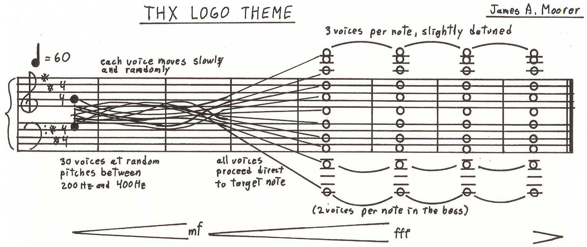

# THX-deepnote

A simulation made in Python of THX's *Deep Note* originally used to showcase
the quality of a cinema. [Here is](https://www.thx.com/deepnote) what it is
actually supposed to sound like.

## Installation

To run the simulation it is required to install the `numpy` and `wave`
libraries. Run `pip install -r requirements.txt` to get required libraries.